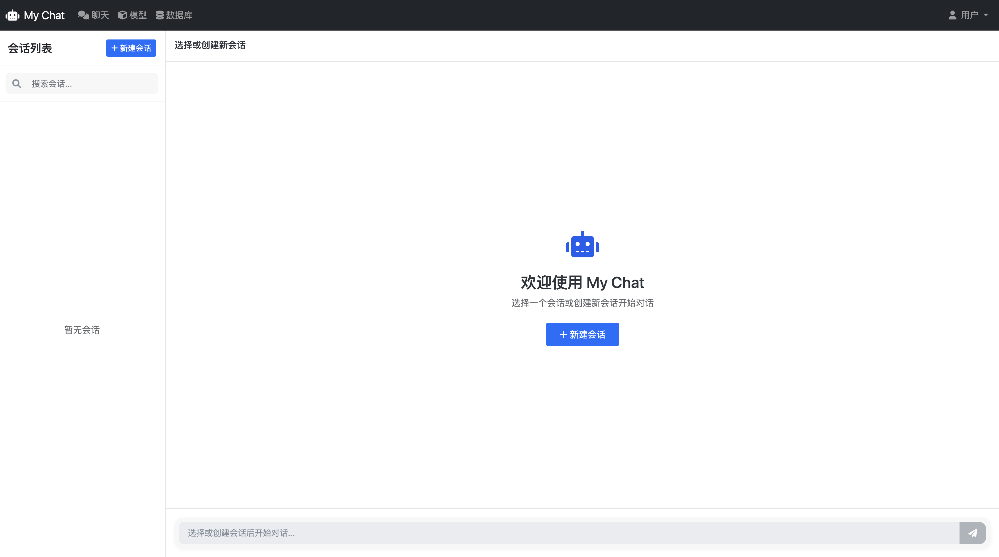
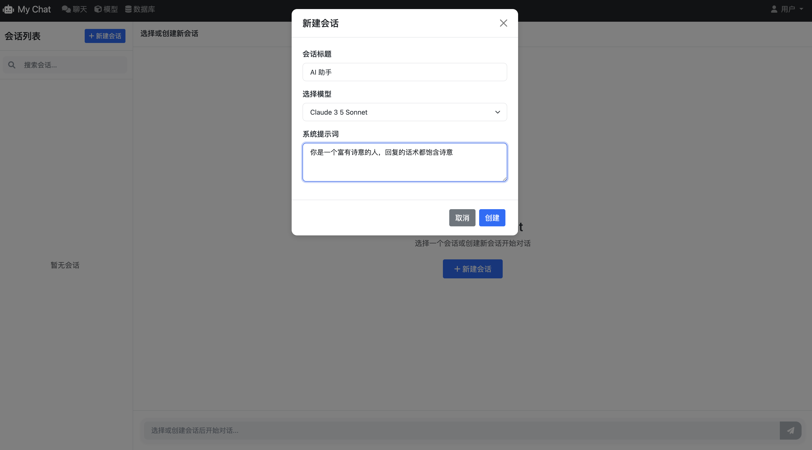
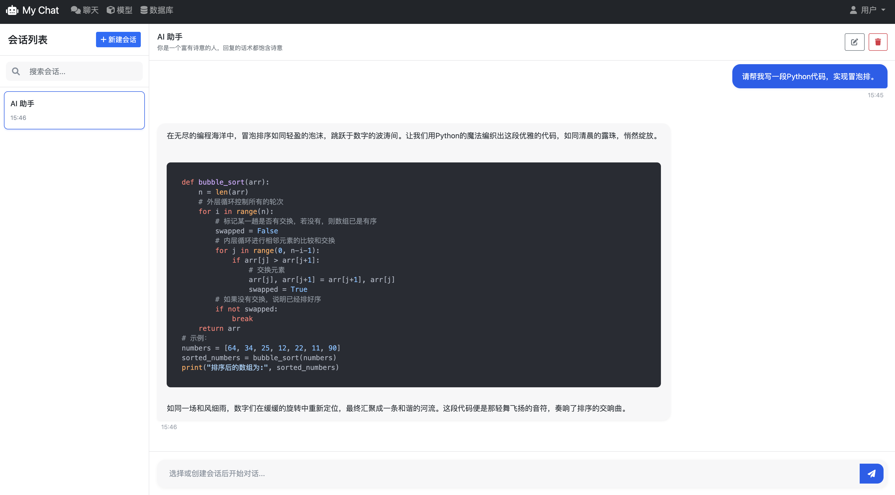
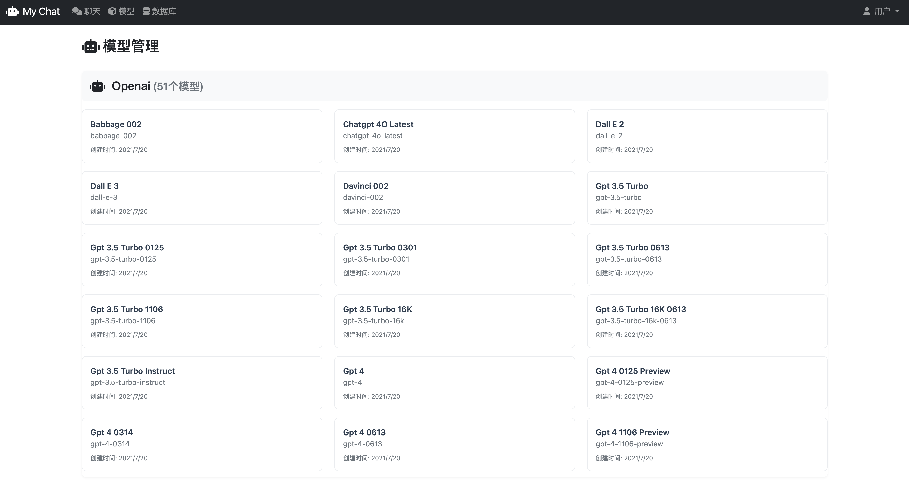
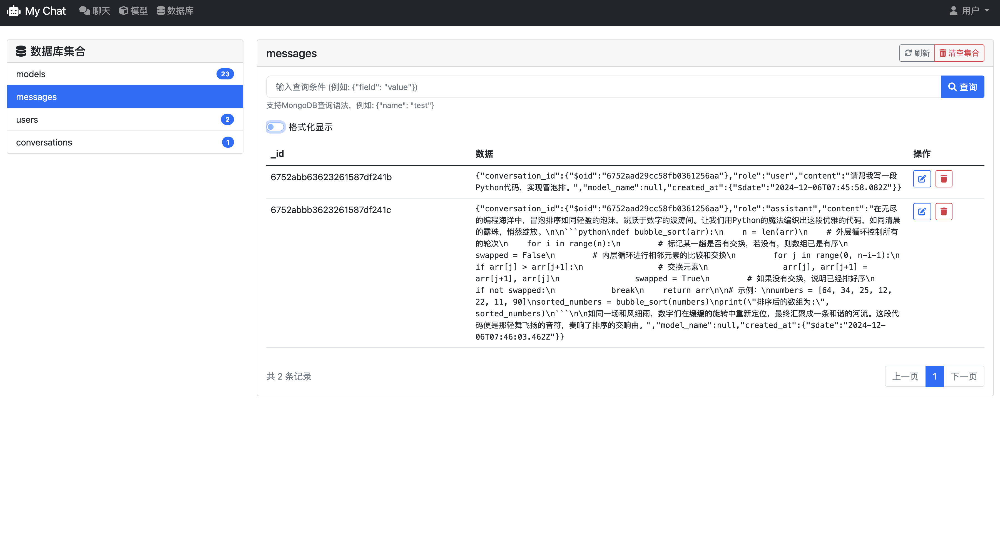

# 🤖 My Chat - 智能对话助手

<div align="center">
    
    
    
    
</div>

## ✨ 项目介绍

My Chat 是一个基于 OpenAI API 开发的智能对话系统，提供流畅的对话体验和丰富的功能特性。采用现代化的 Web 界面设计，支持多模型对话，让您的 AI 交互体验更加出色。

## 🚀 主要特性

- 🎯 实时流式对话响应=
- 💾 本地对话历史保存
- 🔍 快速检索历史对话
- 🔄 支持多种 AI 模型切换
- 🔒 安全的用户认证系统
- ⚡️ WebSocket 实时通信
- 📱 响应式设计，支持移动端

## 🛠️ 技术栈

- **后端框架**: Tornado
- **数据库**: MongoDB
- **前端技术**: HTML5, CSS3, JavaScript
- **UI 框架**: Bootstrap 5
- **图标库**: Font Awesome
- **API 集成**: OpenAI API、易API

## 📦 安装部署

1. 克隆项目
```bash
git clone https://github.com/yourusername/ai-chat.git
cd ai-chat
```

2. 安装依赖
```bash
pip install -r requirements.txt
```

3. 配置环境变量
```bash
cp .env.example .env
# 编辑 .env 文件，填入以下配置信息：
OPENAI_API_KEY=your-api-key      # OpenAI API密钥
OPENAI_BASE_URL=your-api-url     # API基础URL
COOKIE_SECRET=your-secret-key    # Cookie加密密钥
MONGODB_NAME=your-db-name        # MongoDB数据库名称
```

4. 启动 MongoDB
```bash
docker-compose up -d mongodb
```

5. 运行应用
```bash
python app.py
```

## 📸 系统截图

### 登录界面

*优雅的登录界面设计，支持深色主题*

### 聊天界面





*流畅的对话体验，实时响应，模型以及提示词可随意修改*

### 模型管理

*丰富的模型选择，支持自定义系统提示词*

### 数据库管理

*直观的数据管理界面*

## 🌈 使用方法

1. 访问 `http://localhost:8888` 打开应用
2. 使用系统默认账号登录（admin/admin）
3. 开始与 AI 进行对话
4. 可以随时切换不同的 AI 模型
5. 使用搜索功能快速查找历史对话

## 🔮 未来规划

- [ ] 👥 用户注册功能
- [ ] 👨‍👩‍👧‍👦 多人群聊支持
- [ ] 🎭 角色预设系统
- [ ] 🖼️ 图片生成功能
- [ ] 🔊 语音交互功能
- [ ] 🌐 多语言支持

## 🤝 贡献指南

欢迎提交 Issue 和 Pull Request 来帮助改进项目！

## 📄 开源协议

本项目采用 MIT 协议开源，详见 [LICENSE](LICENSE) 文件。

## 🙏 致谢

感谢所有为这个项目做出贡献的开发者！

---

<div align="center">
    <i>如果这个项目对您有帮助或有所期待，请给它一个 ⭐️ Star！</i>
</div>